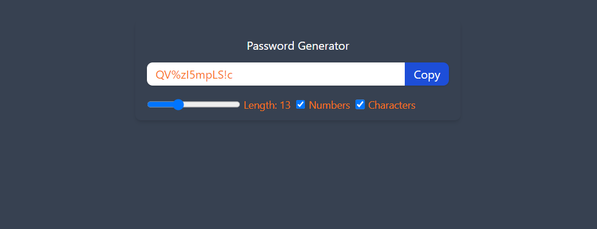

 # Password Generator

## About the Project

This project is a simple yet powerful password generator tool designed to assist users in creating secure passwords. With customizable options for length, inclusion of numbers, and special characters, it provides flexibility to meet various security requirements.

### Features

- Generate random passwords
- Customize password length
- Include numbers and special characters
- Copy generated password to clipboard

## Technologies Used

- React - Frontend library for building user interfaces
- TypeScript - Static type checker for JavaScript

